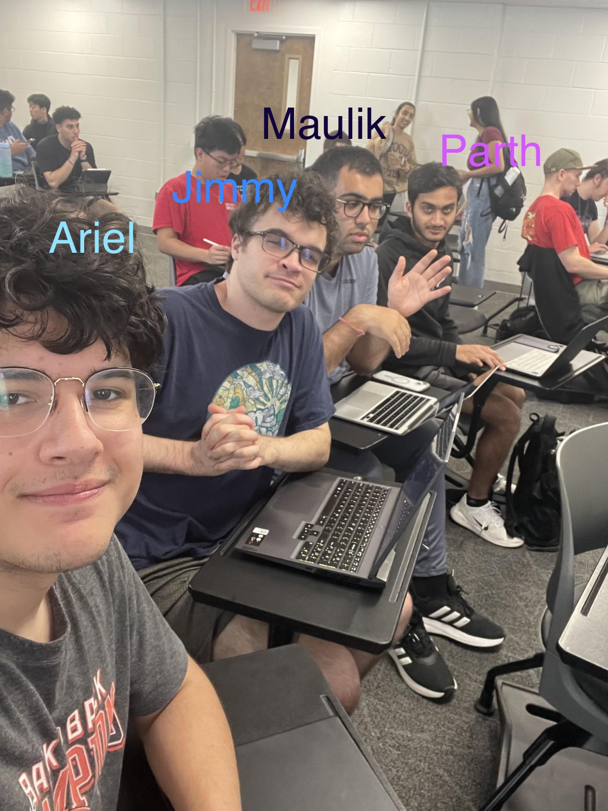

Welcome to our app MyStudySpace!
We look forward to new users utilizing our app!

In our app we look to provide a distraction and ad free study zone for college students so they can be the best version of themselves!

Whether you're prepping for finals or tackling your daily homework, MyStudySpace offers a clean interface with helpful widgets to keep you on track and motivated.

With our renownned widgets that help you focus and take notes, while having useful items such as a calculator at your fingertips, we are ready to help you succeed!

About The Team:
Our creators Jimmy Durkin, Maulik Durani, Ariel Hereddia, and Parth Mendpara are Computer Science students at The University of Georgia looking to foster an atmosphere of learning and success. If you have any suggestions or comments feel free to email: parthme04@gmail.com and we will make sure to get back to you shortly. Thank you so much for supporting our team!

